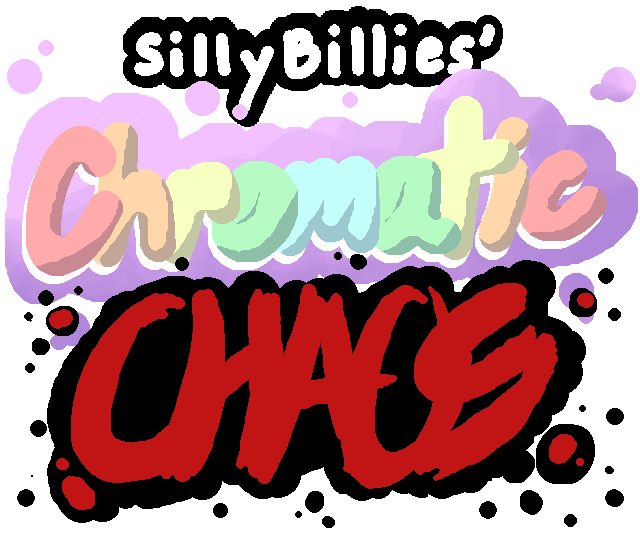

# Silly Billies' Chromatic Chaos

## Play the game free on the Browser:
[Itch.io WebGL Player](https://mkingco.itch.io/silly-billiess-chromatic-chaos)

### Play as Silly Billy, an average armless blue-collar worker who was just recently hired to work at [NONDESCRIPT CONGLOMERATE COMPANY WAREHOUSE]!

### Your job is to sort [NONDESCRIPT CONGLOMERATE COMPANY] packages from a conveyor belt into their respective colored funnels. It's easy!

### However, the working conditions at [NONDESCRIPT CONGLOMERATE COMPANY] are harsh (but ultimately legal), so you must meet your minute-ly quota for boxes or else you'll get [REDACTED]! Good luck!

### This game was made for UNR ACM's "Biggest Little Hackathon" competition by the **Silly Billies**, where groups create and present a program from scratch within a 36-hour time period.
